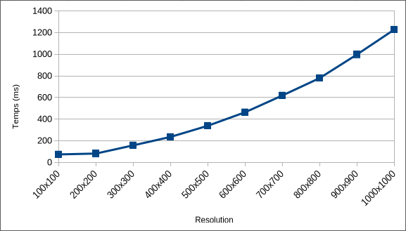
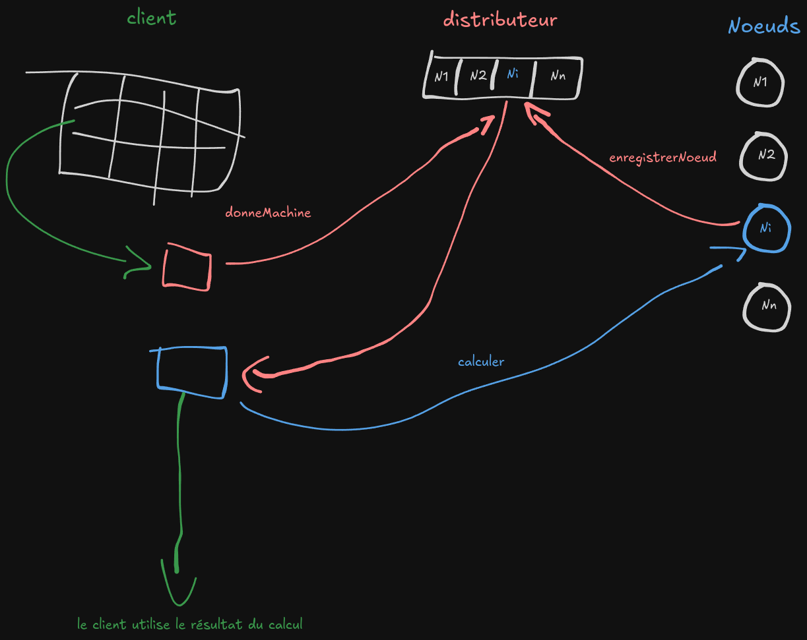

# Programmation répartie 
## Temps de calcul en fonction de la résolution

## Architecture des services

Pour effectuer un calcul, le client va demander un noeud de calcul au serveur distant.   
Le service distant va renvoyer la référence du premier noeud disponible qui s'est au préalable enregistré.   
Une fois la référence distante d'un noeud aquise, le client peut lui envoyer son calcul.   
Le résultat du calcul est ensuite renvoyé à travers la classe `Image` du noeud vers le client qui pourra l'afficher.

### Lancer des calculs en parallèle
Pour lancer les calculs en parallèle, il faut que le client crée un thread par calcul. Le calcul le plus rapide s'affichera donc en premier.

### Diagramme de séquence calcul d'une image

