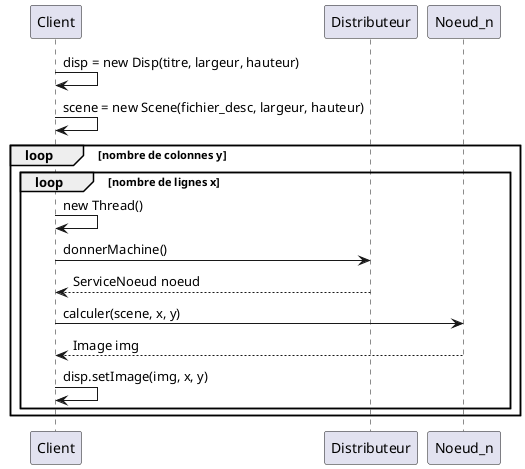

# Programmation répartie - Projet Raytracing

> Kateryna BABACHANAKH  
> Rémi CHOFFAT  
> Mathieu GRAFF  
> Maxime VAULTRIN

**Voir le projet sur GitHub : [github.com/remi-choffat/Raytracing](https://github.com/remi-choffat/Raytracing)**

## Temps de calcul en fonction de la résolution


## Architecture des services


Pour effectuer un calcul, le client va demander un noeud de calcul au serveur distant.   
Le service distant va renvoyer la référence du premier noeud disponible qui s'est au préalable enregistré.   
Une fois la référence distante d'un noeud aquise, le client peut lui envoyer son calcul.   
Le résultat du calcul est ensuite renvoyé à travers la classe `Image` du noeud vers le client qui pourra l'afficher.

### Lancer des calculs en parallèle

Pour lancer les calculs en parallèle, il faut que le client crée un thread par calcul. Le calcul le plus rapide
s'affichera donc en premier.

### Diagramme de séquence calcul d'une image



## Interfaces utilisées

### ServiceNoeud.java

```java
import raytracer.Image;
import raytracer.Scene;

import java.rmi.Remote;
import java.rmi.RemoteException;

/**
 * Interface pour le service de calcul d'image par raytracing.
 * Cette interface definit la methode pour calculer une image a partir d'une scene.
 */
public interface ServiceNoeud extends Remote {

    /**
     * Calcule une image pour une scene donnee dans une zone specifiee.
     *
     * @param scene La scene a calculer.
     * @param x     La coordonnee x du coin superieur gauche de la zone.
     * @param y     La coordonnee y du coin superieur gauche de la zone.
     * @param w     La largeur de la zone a calculer.
     * @param h     La hauteur de la zone a calculer.
     * @return L'image calculee pour la zone specifiee.
     * @throws RemoteException Si une erreur de communication RMI se produit.
     */
    Image calculer(Scene scene, int x, int y, int w, int h) throws RemoteException;

    /**
     * Indique au distributeur que ce noeud est toujours actif.
     * Cette methode est utilisee pour verifier la disponibilite du noeud.
     *
     * @throws RemoteException Si une erreur de communication RMI se produit.
     */
    void jeSuisLa() throws RemoteException;
}
```

### ServiceDistributeur.java

```java
import java.rmi.Remote;
import java.rmi.RemoteException;

/**
 * Interface pour le service distributeur de machines de raytracing.
 * Cette interface definit la methode pour obtenir une machine de calcul.
 */
public interface ServiceDistributeur extends Remote {

    /**
     * Enregistre un noeud de calcul dans le service distributeur.
     *
     * @param noeud le noeud de calcul a enregistrer
     * @throws RemoteException si une erreur de communication RMI se produit
     */
    void enregistrerNoeud(ServiceNoeud noeud) throws RemoteException;

    /**
     * Donne un noeud de calcul disponible pour effectuer un raytracing.
     *
     * @return un objet ServiceNoeud representant le noeud de calcul
     * @throws RemoteException si une erreur de communication RMI se produit
     */
    ServiceNoeud donneMachine() throws RemoteException, NoeudIndisponibleException;

    /**
     * Avertit le distributeur qu'un noeud de calcul est en train de faire un calcul.
     *
     * @param n le noeud de calcul qui effectue le calcul
     * @throws RemoteException si une erreur de communication RMI se produit
     */
    void noeudAvertirCalcul(ServiceNoeud n) throws RemoteException;

    /**
     * Avertit le distributeur qu'un noeud de calcul est libre apres avoir termine un calcul.
     *
     * @param n le noeud de calcul qui est maintenant libre
     * @throws RemoteException si une erreur de communication RMI se produit
     */
    void noeudAvertirLibre(ServiceNoeud n) throws RemoteException;
}
```

### NoeudIndisponibleException.java

```java
/**
 * Indique une indisponibilite de noeuds de calcul
 */
public class NoeudIndisponibleException extends Exception {
    public NoeudIndisponibleException(String s) {
        super(s);
    }
}
```

## Exécution

### Lancer le distributeur

```bash
java EnregistrementDistributeur
```

### Lancer les noeuds

```bash
java LancerNoeud [Local Registry] [Local Port] [Distibuteur IP] [Distibuteur Port]
```

### Lancer le client

```bash
java ClientRaytracer [host] [port] [fichier_description] [largeur] [hauteur]
 [division_x] [division_y]
```

### Vidéo de démonstration

Une [vidéo de démonstration](https://github.com/remi-choffat/Raytracing/blob/master/RMI_video.mp4) est disponible sur
notre dépôt GitHub.